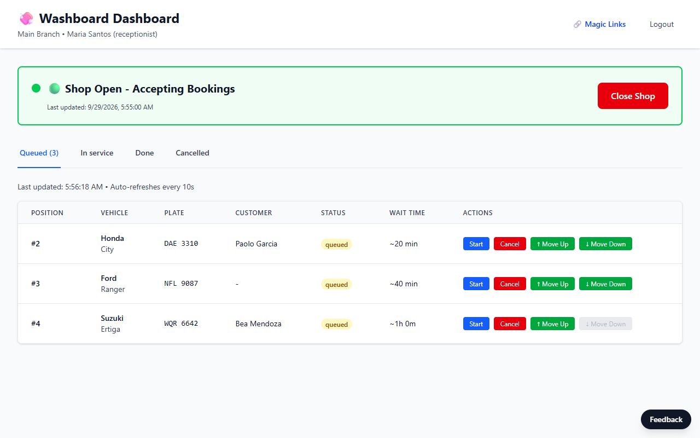
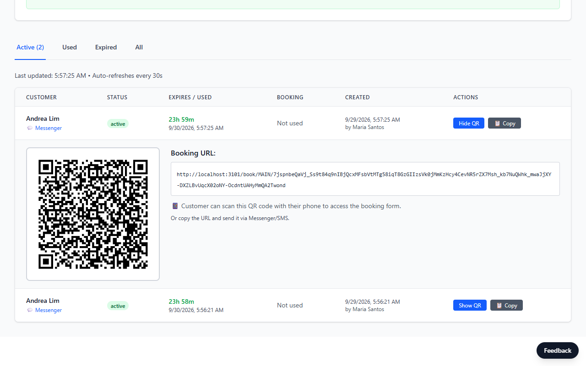
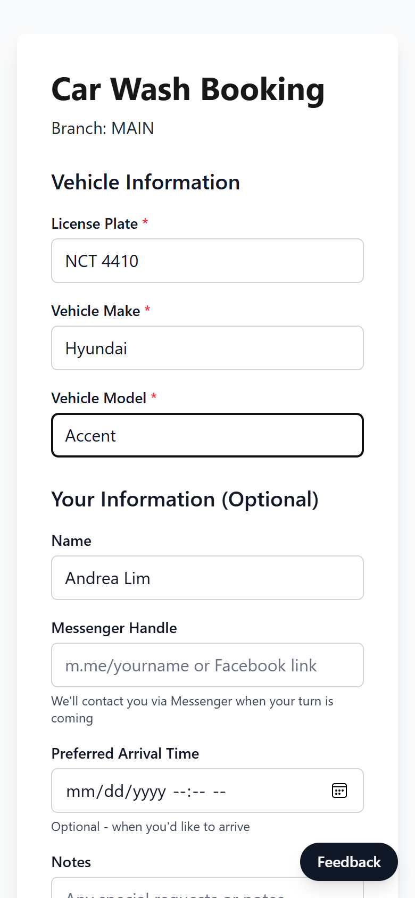
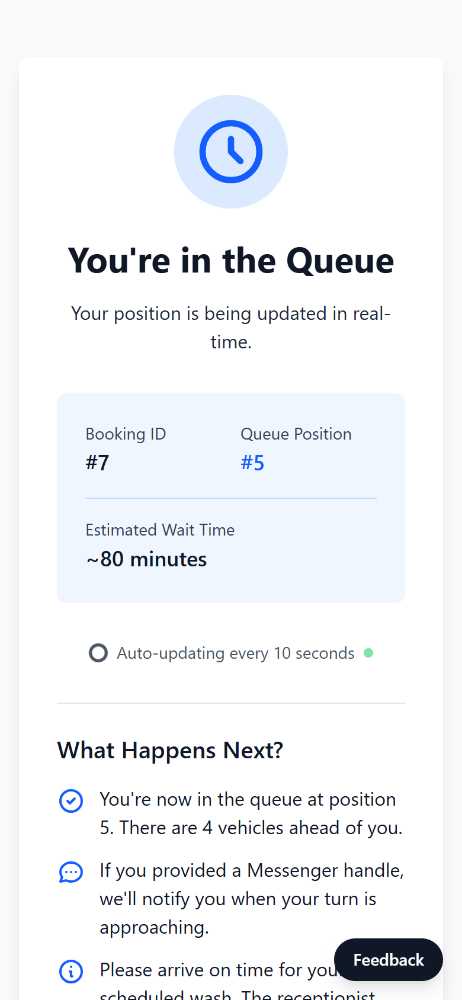
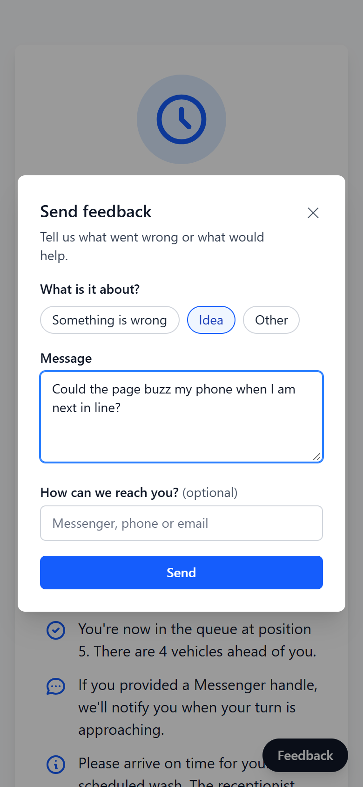
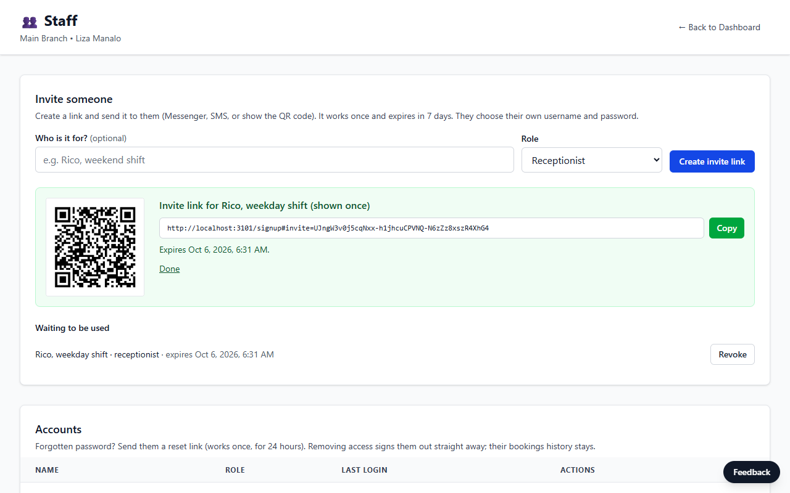
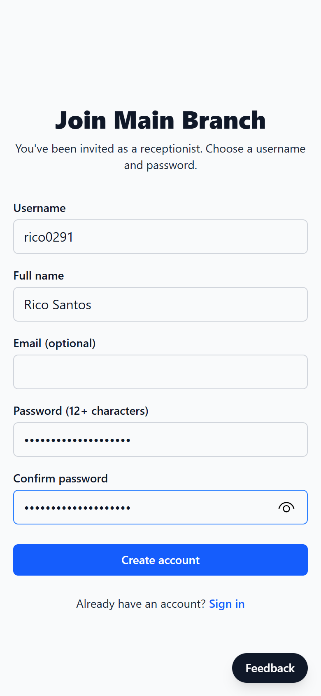
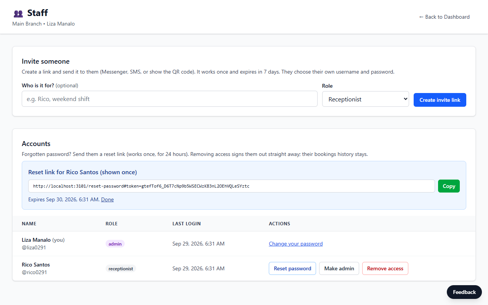
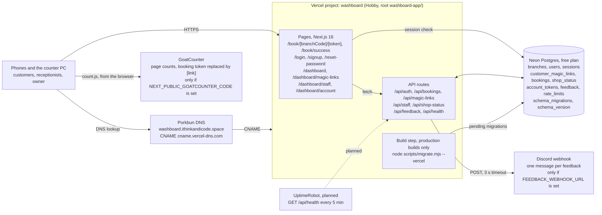
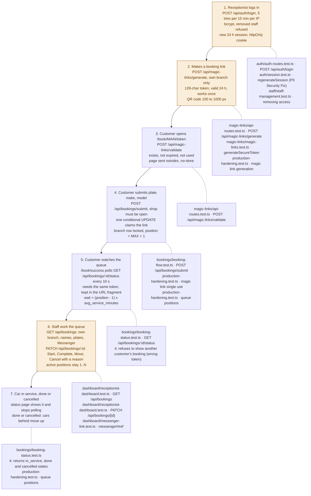

# Washboard

Queue management for a car wash. The receptionist hands each walk-in customer a
QR code; the customer scans it, enters their plate and car, and watches their
place in the queue update on their phone. The receptionist moves cars through
queued → in service → done from a dashboard.

Live: [washboard.ithinkandicode.space](https://washboard.ithinkandicode.space)
(Vercel + Neon Postgres).



## Screens

The receptionist generates a single-use booking link and shows its QR code:



The customer scans it, books, and watches their place in the queue (polled
every 10 seconds). The Feedback button is on every page.

<p>
  
  
  
</p>

The shop owner runs staff accounts from Dashboard → Staff, without a
developer. An invite is a single-use link (or QR code) that expires in 7 days:



The new receptionist opens it on their phone and picks their own username and
password. When someone forgets their password, the owner sends them a reset
link from the same page; removing access signs that person out at once.

<p>
  
</p>



Screenshots are from a local run on 2026-09-29 with made-up people.

## How it works

| Who | Does what | Auth |
|-----|-----------|------|
| Owner (admin) | Everything a receptionist does, plus invites staff, sends password reset links, changes roles, removes access | Same as receptionist, with `role = 'admin'` |
| Receptionist | Logs in, generates a single-use booking link + QR code, manages the queue, opens/closes the shop, changes their own password | Username + password + branch code; DB-backed session cookie |
| Customer | Opens the link, submits plate/make/model, sees position and estimated wait (polled every 10 s) | The link itself: 128-character random token, valid 24 h, works once |
| Anyone | "Feedback" button on every page | None (rate-limited, honeypot) |

Accounts are invite-only. The first owner account is created at `/signup` with
the code in `OWNER_SETUP_CODE`; after that, set the variable back to empty and
invite everyone else from the Staff page. Invite and reset tokens are stored
as SHA-256 hashes and carried in the URL fragment, so they don't reach server
logs or analytics.

Each branch (`branch_code`) is a tenant. The branch comes from the logged-in
receptionist's session, never from request input, and every queue query
filters on it.

## How the system fits together

Two diagrams: first the parts of production and how they connect, then one
booking's path through the app with the tests that pin each step. (Mermaid:
renders on GitHub; VS Code's preview needs the "Markdown Preview Mermaid
Support" extension.)



Three arrows carry most of the story. Everything a phone does goes to the
Vercel project, except GoatCounter's script, which the browser loads
straight from GoatCounter. The only thing the server calls besides Neon is
the Discord webhook, and a Discord outage never loses feedback because the
row is written first. The schema changes in one place: the build step,
which applies pending migrations on production builds only. Preview
deployments use the same database and skip it.



Test paths are under `washboard-app/src/__tests__/`. Amber marks where
access is handed out or customer data leaves the server. Step 1 gives a
session that can read every booking in the branch. Step 2 creates the
customer's only credential: whoever holds the link can book once, and the
same token later reads that one booking's status. Step 6 is where names,
plates and Messenger handles go to staff browsers. The status endpoint in
step 5 returns only the booking's status, position, estimated wait and the
time it was queued.

Mappings the boxes can't show: accounts exist before step 1. The owner
signs up at `/signup` with `OWNER_SETUP_CODE` (3 tries per hour per IP) and
invites everyone else from `/dashboard/staff` with a link that works once
within 7 days (`staff-management.test.ts`, "invite links"). The booking
token spans steps 2 to 5: it's in the page path at step 3, where GoatCounter
and feedback both record `[link]` instead, it's claimed at step 4, and it
moves to the URL fragment for step 5. Closing the shop (`POST
/api/shop-status`) blocks step 4 only, so a link made while the shop is
closed still works once it reopens, and a closed shop doesn't use a link
up. The Feedback button on every page posts to `/api/feedback` (5 per hour
per IP, with a honeypot field). Rate limits are keyed on the client IP
(the password change also on the user), stored in `rate_limits`, and let
requests through if the database errors.

## Stack

- Next.js 16 (App Router, route handlers), React 19, TypeScript, Tailwind CSS 4
- PostgreSQL via `pg` (Neon in production)
- bcrypt (cost 12) for passwords; sessions are random IDs stored in the
  `sessions` table, so logout and account deletion take effect immediately
- Login/signup/feedback rate limits stored in Postgres (`rate_limits`), which
  works across serverless instances
- `qrcode` for QR images, GoatCounter for cookieless page counts
- Vitest against PGlite (Postgres compiled to WASM), so tests exercise the real
  SQL, constraints and triggers without a database server

## Local development

```bash
cd washboard-app
npm install
cp .env.example .env.local      # set DATABASE_URL and OWNER_SETUP_CODE
npm run db:migrate              # applies src/lib/migrations/*.sql
npm run dev                     # http://localhost:3000
```

Then open `/signup`, enter the setup code to create the owner account, and
invite a receptionist from Dashboard → Staff.

| Variable | Required | Purpose |
|----------|----------|---------|
| `DATABASE_URL` | yes | Postgres connection string (Neon pooled URL in production) |
| `NEXT_PUBLIC_APP_URL` | yes in production | Canonical URL used in magic links and QR codes |
| `OWNER_SETUP_CODE` | only to create the first owner | `/signup` with this code creates an admin account; delete it afterwards |
| `FEEDBACK_WEBHOOK_URL` | no | Discord webhook that gets a message per feedback submission |
| `NEXT_PUBLIC_GOATCOUNTER_CODE` | no | GoatCounter site code |

## Checks

```bash
npm test            # 199 tests, PGlite, no DB server needed
npm run typecheck
npx eslint src
npm run build
```

GitHub Actions is turned off for this repo, so run all four locally before
merging. `.github/workflows/ci.yml` runs them again if Actions is turned
back on.

## Deploying

See [docs/PRODUCTION_READINESS.md](docs/PRODUCTION_READINESS.md) for the
deploy runbook, the September 2026 audit findings and the tradeoffs behind
them.

## Layout

```
washboard-app/
  src/app/api/          route handlers (auth, staff, bookings, magic-links, shop-status, feedback, health)
  src/app/book/         customer pages (booking form, live queue status)
  src/app/dashboard/    receptionist pages; staff/ (admins) and account/ (own password)
  src/lib/auth/         sessions, rate limiting, invite and reset tokens
  scripts/              migrate.mjs, make-admin.mjs (recovery when no admin can log in)
  src/lib/migrations/   numbered SQL migrations (applied by scripts/migrate.mjs)
  src/__tests__/        Vitest suites
```
