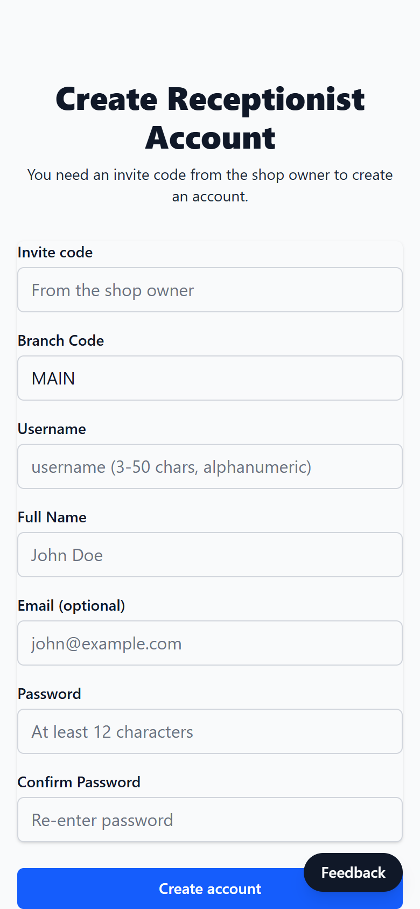

# Washboard

Queue management for a car wash. The receptionist hands each walk-in customer a
QR code; the customer scans it, enters their plate and car, and watches their
place in the queue update on their phone. The receptionist moves cars through
queued → in service → done from a dashboard.

Live: [washboard.ithinkandicode.space](https://washboard.ithinkandicode.space)
(Vercel + Neon Postgres).


## Screens

The receptionist generates a single-use booking link and shows its QR code:


The customer scans it, books, and watches their place in the queue (polled
every 10 seconds). The Feedback button is on every page; receptionist signup
needs the owner's invite code.

<p>
  
  
  
  
</p>

Screenshots are from a local run on 2026-09-29 with made-up customers.

## How it works

| Who | Does what | Auth |
|-----|-----------|------|
| Receptionist | Logs in, generates a single-use booking link + QR code, manages the queue, opens/closes the shop | Username + password + branch code; DB-backed session cookie |
| Customer | Opens the link, submits plate/make/model, sees position and estimated wait (polled every 10 s) | The link itself: 128-character random token, valid 24 h, works once |
| Anyone | "Feedback" button on every page | None (rate-limited, honeypot) |

Receptionist accounts are invite-only: signup requires the code in
`SIGNUP_INVITE_CODE`, and is closed when that variable is unset.

Each branch (`branch_code`) is a tenant. The branch comes from the logged-in
receptionist's session, never from request input, and every queue query
filters on it.

## Stack

- Next.js 16 (App Router, route handlers), React 19, TypeScript, Tailwind CSS 4
- PostgreSQL via `pg` (Neon in production)
- bcrypt (cost 12) for passwords; sessions are random IDs stored in the
  `sessions` table, so logout and account deletion take effect immediately
- Login/signup/feedback rate limits stored in Postgres (`rate_limits`), which
  works across serverless instances
- `qrcode` for QR images, GoatCounter for cookieless page counts
- Vitest against PGlite (Postgres compiled to WASM), so tests exercise the real
  SQL, constraints and triggers without a database server

## Local development

```bash
cd washboard-app
npm install
cp .env.example .env.local      # set DATABASE_URL and SIGNUP_INVITE_CODE
npm run db:migrate              # applies src/lib/migrations/*.sql
npm run dev                     # http://localhost:3000
```

Then open `/signup`, use your invite code to create the first receptionist,
and log in.

| Variable | Required | Purpose |
|----------|----------|---------|
| `DATABASE_URL` | yes | Postgres connection string (Neon pooled URL in production) |
| `NEXT_PUBLIC_APP_URL` | yes in production | Canonical URL used in magic links and QR codes |
| `SIGNUP_INVITE_CODE` | no | Enables receptionist signup with this code |
| `FEEDBACK_WEBHOOK_URL` | no | Discord webhook that gets a message per feedback submission |
| `NEXT_PUBLIC_GOATCOUNTER_CODE` | no | GoatCounter site code |

## Checks

```bash
npm test            # 153 tests, PGlite, no DB server needed
npm run typecheck
npx eslint src
npm run build
```

GitHub Actions runs all four on every push and pull request
(`.github/workflows/ci.yml`).

## Deploying

See [docs/PRODUCTION_READINESS.md](docs/PRODUCTION_READINESS.md) for the
deploy runbook, the September 2026 audit findings and the tradeoffs behind
them.

## Layout

```
washboard-app/
  src/app/api/          route handlers (auth, bookings, magic-links, shop-status, feedback, health)
  src/app/book/         customer pages (booking form, live queue status)
  src/app/dashboard/    receptionist pages
  src/lib/auth/         sessions, rate limiting
  src/lib/migrations/   numbered SQL migrations (applied by scripts/migrate.mjs)
  src/__tests__/        Vitest suites
```
